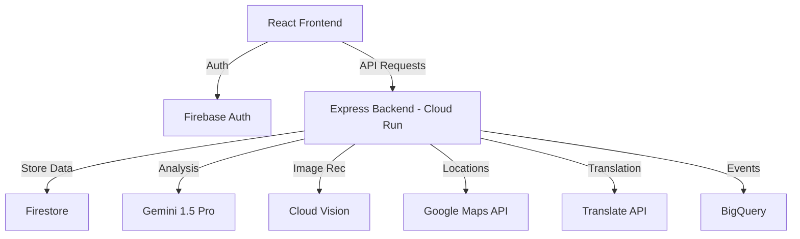

# NutriSense 🥗

> AI-powered personal nutrition coach built for AMD Slingshot Hackathon

## Live Demo
- **App**: https://YOUR_PROJECT.web.app
- **API**: https://nutrisense-backend-xxxx-uc.a.run.app/health

## Google Services Used
| Service | Purpose |
|---|---|
| Gemini 1.5 Pro | AI nutrition analysis & meal planning |
| Cloud Vision API | Food photo recognition |
| Maps Platform | Healthy restaurant finder |
| Google Fit API | Activity data for personalized advice |
| Firebase Auth | Google Sign-In |
| Firestore | Real-time data storage |
| Cloud Run | Scalable backend hosting |
| Firebase Hosting | Frontend deployment |
| Translate API | Hindi/Bengali/Tamil support |
| BigQuery | Analytics & insights |

## Architecture

## Local Setup
1. Clone: `git clone https://github.com/YOUR_USERNAME/nutrisense`
2. Backend: `cd backend && npm install && cp .env.example .env` → fill keys
3. Frontend: `cd frontend && npm install`
4. Run backend: `npm run dev`
5. Run frontend: `npm run dev`

## Team
[Your name] — AMD Slingshot Kolkata 2025
